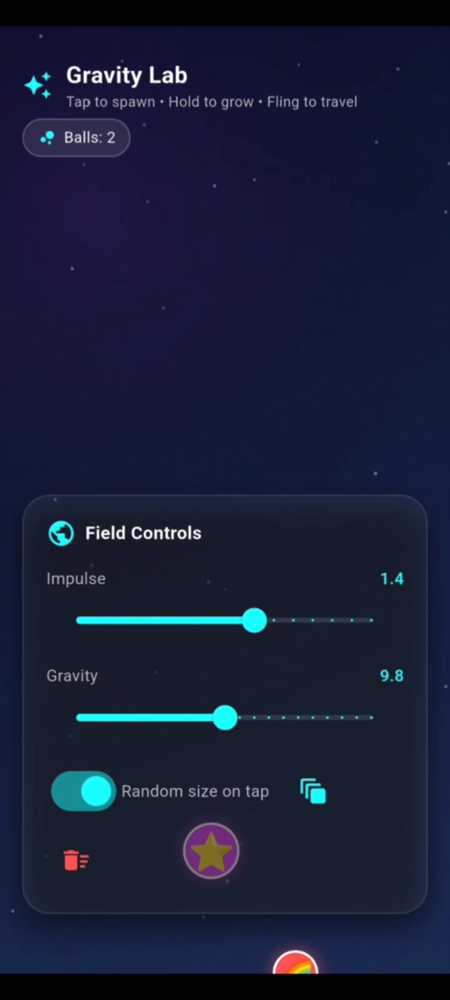
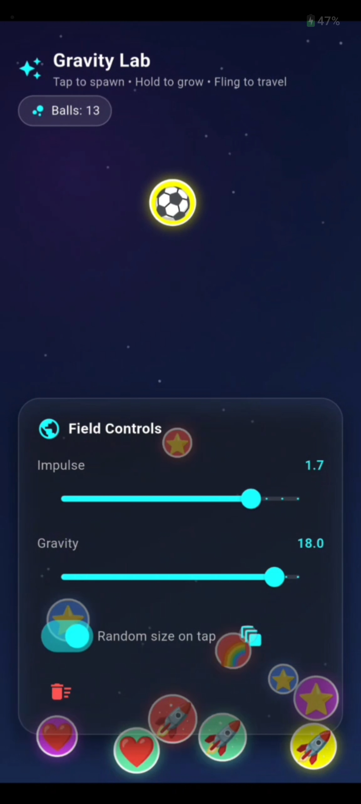

# AR Gravity Simulator (GSoC 2026 Entry Task)

## Overview
This project is a prototype of a Gravity and Planetary Physics Simulator developed for the GSoC 2026 entry task under the International Catrobat Association.

The simulator demonstrates real-time N-body gravitational interactions between celestial bodies using Newtonian physics.

While the final project aims to integrate Augmented Reality (AR) using Unity, this implementation focuses on building a strong, modular, and scalable physics engine using Flutter.

---

## 🚀 Features
- Real-time N-body gravitational simulation  
- Continuous position and velocity updates  
- Stable orbit formation (circular / elliptical)  
- Adjustable parameters (mass, velocity, distance)  
- Interactive UI for simulation control  

---

## 🛠️ Tech Stack
- Flutter (Dart)  
- Custom Physics Engine (Newtonian Gravity)  
- Canvas-based real-time rendering  

---

## 🧪 Physics Model
The simulation is based on Newton’s Law of Gravitation:

F = G × (m₁ × m₂) / r²  

Each body experiences forces from all other bodies, and motion is updated iteratively using numerical integration.

---

## ⚙️ Simulation Details
- Integration Method: Euler (current)  
- Planned Upgrade: Runge-Kutta (RK4) for improved accuracy  
- Time Complexity: **O(n²)** for N-body interactions  
- Future Optimization: Spatial partitioning (Octree / Grid)

---

## 🎥 Demo
👉 https://drive.google.com/file/d/1RuTkYGamtZQP1qCftLoZ_qJqi02tjsBu/view?usp=sharing

---

## 🖼️ Screenshots

---

## 📌 Project Scope in GSoC Context
This repository represents **Phase 1 (Physics Engine + Simulation UI)** of the complete AR Gravity Simulator.

The next phase involves integrating this system into Unity using AR Foundation for:
- 3D visualization  
- Real-world interaction  
- AR-based simulation placement  

---

## 🤔 Why Flutter?
This implementation focuses on rapid prototyping of the physics engine and interactive controls.

Flutter enables:
- Fast UI development  
- Real-time rendering  
- Clean modular architecture  

This makes it ideal for building and validating simulation logic before porting to Unity for AR integration.

---

## 🔮 Future Work
- Integration with Unity + AR Foundation  
- Advanced numerical methods (Runge-Kutta RK4)  
- Orbit visualization and trajectory prediction  
- Performance optimization for large-scale simulations  
- Porting physics engine to Unity (C#)  

---

## 📂 Repository Structure
- `/lib` → Core simulation logic  
- `/ui` → Rendering and interaction  
- `/models` → Celestial body definitions  

---

## 👩‍💻 Author
Challa Rishitha Reddy  

- GitHub: https://github.com/rishithareddychalla  
- LinkedIn: https://www.linkedin.com/in/rishitha-reddy-challa/

---

## ⭐ Notes
This project focuses on building a strong foundation in physics simulation, which will be extended into a full AR-based educational tool during GSoC.